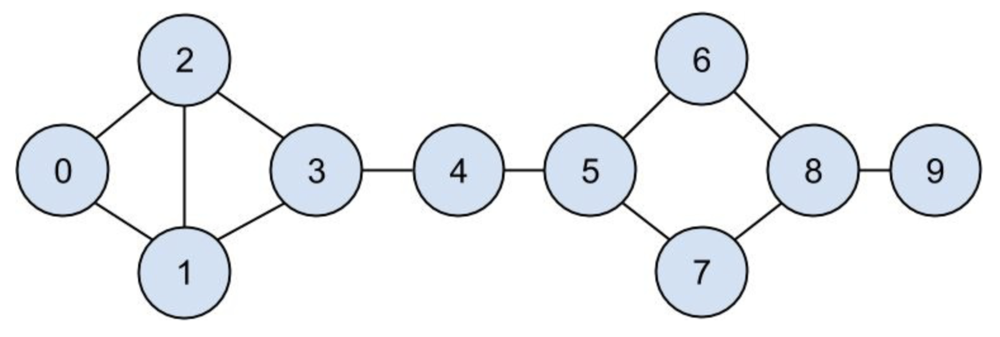

# Lab 1

The goal of this lab is to install required tools for the class and practice some basic data virtualization.

## Install Dependencies

_Prerequisite_ You need to have Python3 install in your machine.

1. Setup Python3 virtual environment

```
virtualenv venv
```

2. Activate your virtual environment

```
source venv/bin/activate
```

3. Install PIP dependencies

```
pip3 install --upgrade jupyter matplotlib numpy pandas scipy scikit-learn
```

4. Check your installation

```
python3 -c "import jupyter, matplotlib, numpy, pandas, scipy, sklearn"
```

5. Install VSCode with Python plugin

6. Run Jupyter application.

```
jupyter notebook
```

7. Turn on matplotlib inline mode in Jupyter

```matplotlib inline```

# Part I

Run charts.py in jupyter and capture the screen output.

# Part II

Implements two functions in friends.py.


